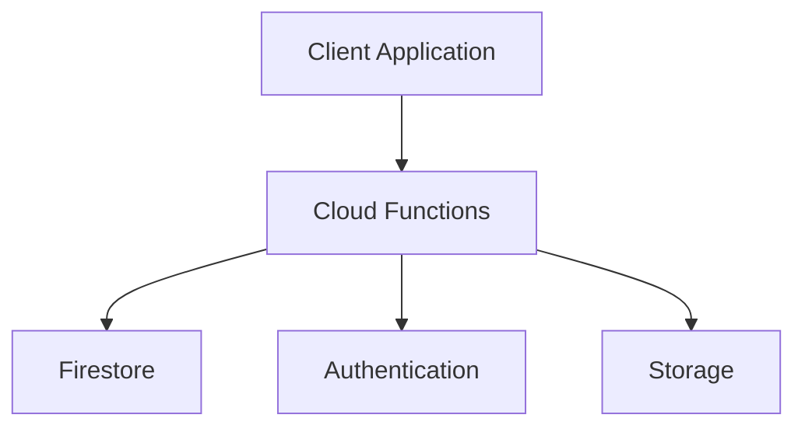

# Functions Overview

> Understanding Firebase Cloud Functions serverless architecture and backend execution workflows.

---

# 📚 Table of Contents

- [Functions Overview](#functions-overview)
- [📚 Table of Contents](#-table-of-contents)
- [📌 Overview](#-overview)
- [🏗️ Serverless Architecture](#️-serverless-architecture)
- [⚙️ Function Types](#️-function-types)
- [✅ Advantages](#-advantages)
- [⚠️ Limitations](#️-limitations)
- [📖 References](#-references)
- [🧠 Final Notes](#-final-notes)

---

# 📌 Overview

Firebase Cloud Functions allows developers to execute backend logic without managing servers.

Functions are triggered by:

- HTTP requests
- Firestore events
- Authentication events
- Schedules
- Storage events

---

# 🏗️ Serverless Architecture

---

# ⚙️ Function Types

| Type | Description |
|---|---|
| HTTP Functions | API endpoints |
| Firestore Triggers | Database events |
| Auth Triggers | Authentication events |
| Scheduled Functions | Automated tasks |

---

# ✅ Advantages

> [!TIP]
> Serverless systems reduce infrastructure management complexity.

- Automatic scaling
- Event-driven execution
- Simplified deployments
- Reduced server management

---

# ⚠️ Limitations

> [!WARNING]
> Cold starts may impact latency-sensitive workloads.

Common limitations:

- Execution time limits
- Cold starts
- Vendor lock-in
- Resource constraints

---

# 📖 References

- https://firebase.google.com/docs/functions
- https://cloud.google.com/functions

---

# 🧠 Final Notes

Cloud Functions are ideal for scalable backend automation and lightweight APIs.