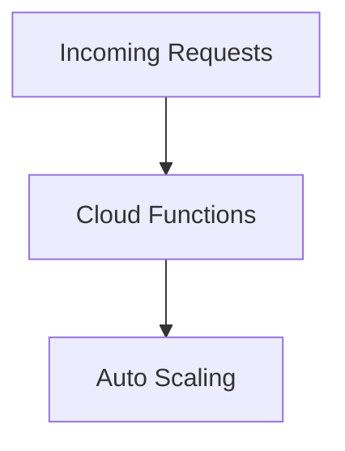

# Functions Scaling

> Scaling Firebase Cloud Functions for enterprise workloads.

---

# 📚 Table of Contents

- [Functions Scaling](#functions-scaling)
- [📚 Table of Contents](#-table-of-contents)
- [📌 Overview](#-overview)
- [🏗️ Scaling Model](#️-scaling-model)
- [⚠️ Scaling Challenges](#️-scaling-challenges)
- [✅ Best Practices](#-best-practices)
- [📖 References](#-references)
- [🧠 Final Notes](#-final-notes)

---

# 📌 Overview

Cloud Functions automatically scale based on incoming workload demand.

---

# 🏗️ Scaling Model

---

# ⚠️ Scaling Challenges

Common scaling issues:

- Cold starts
- High concurrency
- Resource exhaustion
- Long execution times

---

# ✅ Best Practices

> [!TIP]
> Keep functions lightweight and stateless.

Recommendations:

- Minimize dependencies
- Optimize initialization
- Use retries carefully
- Monitor execution metrics

---

# 📖 References

- https://firebase.google.com/docs/functions
- https://cloud.google.com/functions/docs/bestpractices

---

# 🧠 Final Notes

Efficient scaling strategies improve reliability and reduce serverless costs.