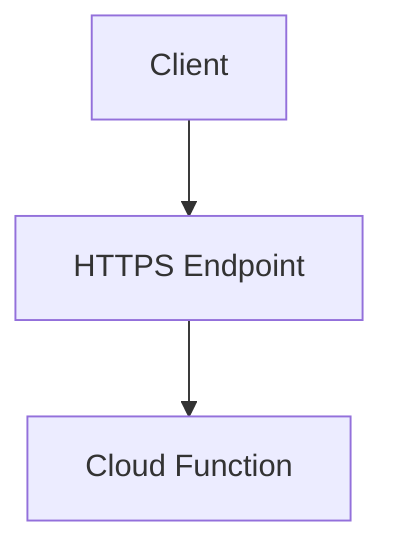

# HTTP Functions

> Building serverless HTTP APIs using Firebase Cloud Functions.

---

# 📚 Table of Contents

- [HTTP Functions](#http-functions)
- [📚 Table of Contents](#-table-of-contents)
- [📌 Overview](#-overview)
- [⚙️ HTTP Architecture](#️-http-architecture)
- [🧪 HTTP Function Example](#-http-function-example)
- [🔐 Security Considerations](#-security-considerations)
- [🚨 Common Issues](#-common-issues)
- [📖 References](#-references)
- [🧠 Final Notes](#-final-notes)

---

# 📌 Overview

HTTP Functions expose serverless backend endpoints accessible through HTTPS requests.

---

# ⚙️ HTTP Architecture



---

# 🧪 HTTP Function Example

```javascript
const functions = require("firebase-functions");

exports.helloWorld = functions.https.onRequest((req, res) => {
  res.send("Hello World");
});
```

---

# 🔐 Security Considerations

> [!IMPORTANT]
> Public HTTP endpoints should always validate authentication and input data.

Best practices:

- Validate tokens
- Sanitize input
- Limit request size
- Use rate limiting

---

# 🚨 Common Issues

| Issue | Cause |
|---|---|
| Timeout | Long execution |
| Unauthorized | Missing token validation |
| High latency | Cold starts |

---

# 📖 References

- https://firebase.google.com/docs/functions/http-events
- https://cloud.google.com/functions/docs

---

# 🧠 Final Notes

HTTP Functions are commonly used for APIs, webhooks, and backend integrations.