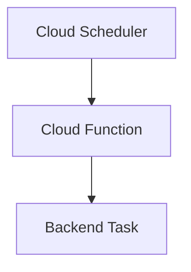

# Scheduled Functions

> Running automated scheduled tasks using Firebase Cloud Functions.

---

# 📚 Table of Contents

- [Scheduled Functions](#scheduled-functions)
- [📚 Table of Contents](#-table-of-contents)
- [📌 Overview](#-overview)
- [⚙️ Scheduling Architecture](#️-scheduling-architecture)
- [🧪 Scheduled Function Example](#-scheduled-function-example)
- [✅ Common Use Cases](#-common-use-cases)
- [📖 References](#-references)
- [🧠 Final Notes](#-final-notes)

---

# 📌 Overview

Scheduled Functions execute automated backend tasks at defined intervals.

---

# ⚙️ Scheduling Architecture



---

# 🧪 Scheduled Function Example

```javascript
exports.dailyCleanup = functions.pubsub
  .schedule("every 24 hours")
  .onRun((context) => {
    console.log("Cleanup executed");
  });
```

---

# ✅ Common Use Cases

- Database cleanup
- Report generation
- Scheduled backups
- Analytics aggregation

---

# 📖 References

- https://firebase.google.com/docs/functions/schedule-functions
- https://cloud.google.com/scheduler

---

# 🧠 Final Notes

Scheduled Functions simplify backend automation and maintenance workflows.