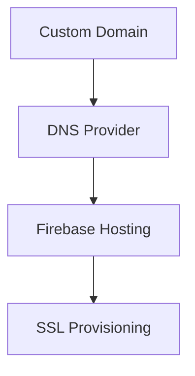

# Custom Domains

> Configuring custom domains for Firebase Hosting environments.

---

# 📚 Table of Contents

- [Custom Domains](#custom-domains)
- [📚 Table of Contents](#-table-of-contents)
- [📌 Overview](#-overview)
- [⚙️ Domain Configuration](#️-domain-configuration)
- [🧪 DNS Workflow](#-dns-workflow)
- [🔐 SSL Configuration](#-ssl-configuration)
- [🚨 Common Issues](#-common-issues)
- [📖 References](#-references)
- [🧠 Final Notes](#-final-notes)

---

# 📌 Overview

Firebase Hosting supports custom domains for production deployments.

---

# ⚙️ Domain Configuration

Steps:

1. Add custom domain
2. Verify ownership
3. Configure DNS records
4. Wait for SSL provisioning

---

# 🧪 DNS Workflow

---

# 🔐 SSL Configuration

> [!TIP]
> Firebase automatically provisions SSL certificates for verified domains.

---

# 🚨 Common Issues

| Issue | Cause |
|---|---|
| SSL pending | DNS propagation delay |
| Domain verification failed | Incorrect DNS records |
| Website unavailable | Invalid configuration |

---

# 📖 References

- https://firebase.google.com/docs/hosting/custom-domain
- https://cloud.google.com/load-balancing/docs/ssl-certificates

---

# 🧠 Final Notes

Proper domain configuration is critical for production-grade deployments.