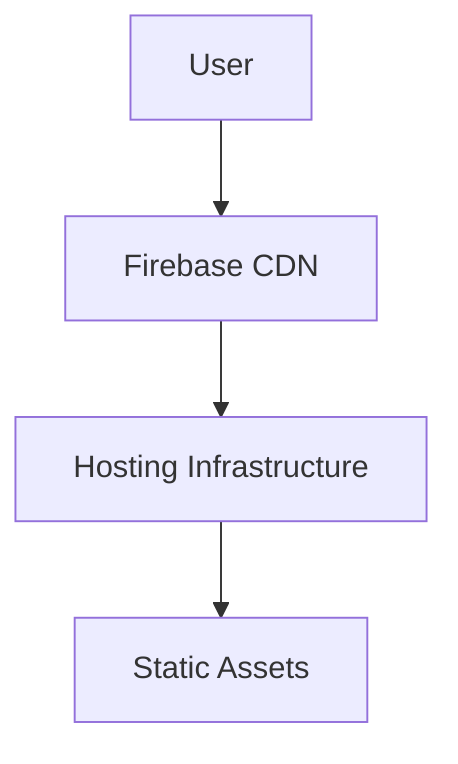

# Firebase Hosting

> Understanding Firebase Hosting architecture, CDN distribution, and modern web deployment workflows.

---

# 📚 Table of Contents

- [Firebase Hosting](#firebase-hosting)
- [📚 Table of Contents](#-table-of-contents)
- [📌 Overview](#-overview)
- [🏗️ Hosting Architecture](#️-hosting-architecture)
- [⚙️ Core Features](#️-core-features)
- [🔐 Security Features](#-security-features)
- [✅ Advantages](#-advantages)
- [📖 References](#-references)
- [🧠 Final Notes](#-final-notes)

---

# 📌 Overview

Firebase Hosting is a secure and scalable hosting platform for web applications and static content.

---

# 🏗️ Hosting Architecture

---

# ⚙️ Core Features

| Feature | Description |
|---|---|
| Global CDN | Low-latency delivery |
| SSL Certificates | HTTPS by default |
| Fast Deployments | Instant publishing |
| Rollbacks | Deployment recovery |
| Custom Domains | Domain integration |

---

# 🔐 Security Features

> [!IMPORTANT]
> Firebase Hosting automatically provisions SSL certificates.

Security benefits:

- HTTPS enforcement
- Secure CDN delivery
- Integrated Firebase Authentication

---

# ✅ Advantages

- Global performance
- Fast deployments
- Managed infrastructure
- Secure hosting
- Integrated CI/CD support

---

# 📖 References

- https://firebase.google.com/docs/hosting
- https://cloud.google.com/cdn

---

# 🧠 Final Notes

Firebase Hosting is optimized for modern JAMstack and serverless frontend architectures.