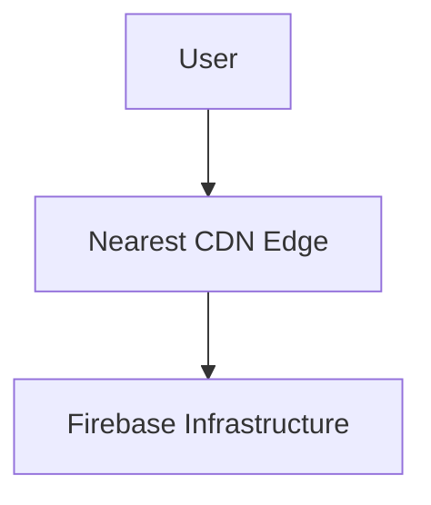

# Hosting CDN

> Understanding Firebase Hosting CDN architecture and global content delivery systems.

---

# 📚 Table of Contents

- [Hosting CDN](#hosting-cdn)
- [📚 Table of Contents](#-table-of-contents)
- [📌 Overview](#-overview)
- [🌍 CDN Architecture](#-cdn-architecture)
- [⚙️ Content Delivery Workflow](#️-content-delivery-workflow)
- [✅ Benefits](#-benefits)
- [📖 References](#-references)
- [🧠 Final Notes](#-final-notes)

---

# 📌 Overview

Firebase Hosting uses a global CDN to deliver content with low latency.

---

# 🌍 CDN Architecture

---

# ⚙️ Content Delivery Workflow

CDN systems:

- Cache static assets
- Reduce latency
- Minimize origin requests
- Improve availability

---

# ✅ Benefits

| Benefit | Description |
|---|---|
| Low Latency | Faster global delivery |
| Scalability | Handles traffic spikes |
| Reduced Load | Fewer origin requests |
| Availability | Improved uptime |

---

# 📖 References

- https://firebase.google.com/docs/hosting
- https://cloud.google.com/cdn

---

# 🧠 Final Notes

CDN-based delivery systems are essential for modern high-performance applications.