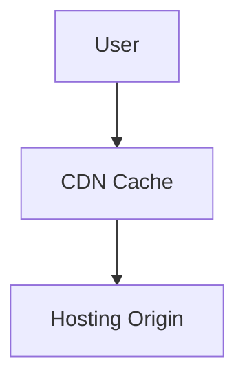

# Hosting Caching

> Optimizing Firebase Hosting performance using caching strategies.

---

# 📚 Table of Contents

- [Hosting Caching](#hosting-caching)
- [📚 Table of Contents](#-table-of-contents)
- [📌 Overview](#-overview)
- [⚙️ Cache Architecture](#️-cache-architecture)
- [🧪 Cache Configuration](#-cache-configuration)
- [✅ Best Practices](#-best-practices)
- [📖 References](#-references)
- [🧠 Final Notes](#-final-notes)

---

# 📌 Overview

Caching improves application performance and reduces bandwidth usage.

---

# ⚙️ Cache Architecture



---

# 🧪 Cache Configuration

Example cache headers:

```json
{
  "headers": [
    {
      "source": "**/*.@(js|css)",
      "headers": [
        {
          "key": "Cache-Control",
          "value": "max-age=31536000"
        }
      ]
    }
  ]
}
```

---

# ✅ Best Practices

> [!TIP]
> Cache static assets aggressively for optimal performance.

Recommendations:

- Cache immutable assets
- Use versioned files
- Avoid caching sensitive data
- Configure CDN headers properly

---

# 📖 References

- https://firebase.google.com/docs/hosting/full-config
- https://developer.mozilla.org/en-US/docs/Web/HTTP/Caching

---

# 🧠 Final Notes

Effective caching strategies improve scalability and user experience.