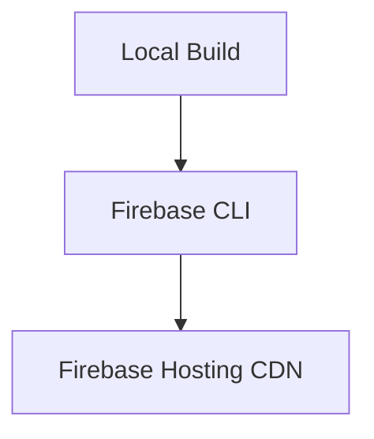

# Hosting Deployments

> Deploying Firebase Hosting environments using Firebase CLI workflows.

---

# 📚 Table of Contents

- [Hosting Deployments](#hosting-deployments)
- [📚 Table of Contents](#-table-of-contents)
- [📌 Overview](#-overview)
- [⚙️ Deployment Workflow](#️-deployment-workflow)
- [🧪 Deployment Commands](#-deployment-commands)
- [🚨 Common Issues](#-common-issues)
- [📖 References](#-references)
- [🧠 Final Notes](#-final-notes)

---

# 📌 Overview

Firebase Hosting deployments publish frontend assets to Google's global infrastructure.

---

# ⚙️ Deployment Workflow



---

# 🧪 Deployment Commands

Initialize Hosting:

```bash
firebase init hosting
```

Deploy Hosting:

```bash
firebase deploy --only hosting
```

---

# 🚨 Common Issues

| Issue | Cause |
|---|---|
| Build failure | Invalid frontend build |
| Permission denied | Missing project access |
| Routing errors | Incorrect rewrites |

---

# 📖 References

- https://firebase.google.com/docs/hosting
- https://firebase.google.com/docs/cli

---

# 🧠 Final Notes

Reliable deployment pipelines improve operational stability and release consistency.