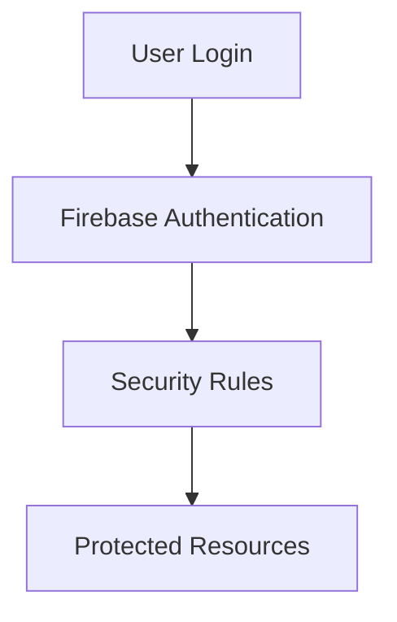

# Authentication Based Rules

> Implementing authentication-aware access control using Firebase Security Rules.

---

# 📚 Table of Contents

- [Authentication Based Rules](#authentication-based-rules)
- [📚 Table of Contents](#-table-of-contents)
- [📌 Overview](#-overview)
- [🏗️ Authentication Flow](#️-authentication-flow)
- [🧪 Rule Examples](#-rule-examples)
- [🔐 Security Benefits](#-security-benefits)
- [📖 References](#-references)
- [🧠 Final Notes](#-final-notes)

---

# 📌 Overview

Authentication-based rules use Firebase Authentication state to control access.

---

# 🏗️ Authentication Flow



---

# 🧪 Rule Examples

```javascript
allow read: if request.auth != null;
```

Validate ownership:

```javascript
allow write: if request.auth.uid == userId;
```

---

# 🔐 Security Benefits

Advantages:

- User-specific access
- Ownership validation
- Reduced unauthorized access
- Secure resource isolation

---

# 📖 References

- https://firebase.google.com/docs/rules/rules-and-auth
- https://firebase.google.com/docs/auth

---

# 🧠 Final Notes

Authentication-aware authorization is essential for secure multi-user systems.