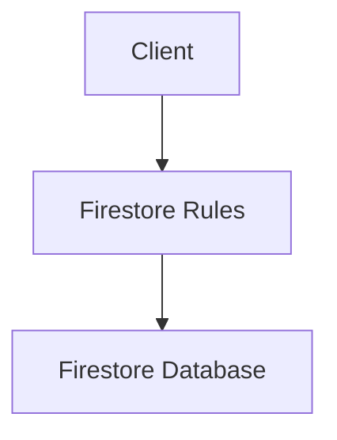

# Firestore Security Rules

> Protecting Firestore databases using Firebase Security Rules.

---

# 📚 Table of Contents

- [Firestore Security Rules](#firestore-security-rules)
- [📚 Table of Contents](#-table-of-contents)
- [📌 Overview](#-overview)
- [🏗️ Security Architecture](#️-security-architecture)
- [🧪 Rules Example](#-rules-example)
- [🔐 Access Validation](#-access-validation)
- [🚨 Common Risks](#-common-risks)
- [📖 References](#-references)
- [🧠 Final Notes](#-final-notes)

---

# 📌 Overview

Firestore Security Rules define who can read and write database documents.

---

# 🏗️ Security Architecture



---

# 🧪 Rules Example

```javascript
rules_version = '2';

service cloud.firestore {
  match /databases/{database}/documents {

    match /users/{userId} {
      allow read, write: if request.auth != null;
    }
  }
}
```

---

# 🔐 Access Validation

Security Rules can validate:

- Authentication
- Roles
- Request data
- Ownership
- Field restrictions

---

# 🚨 Common Risks

> [!WARNING]
> Public Firestore access may expose sensitive application data.

Common security issues:

- Overly permissive rules
- Missing authentication validation
- Unrestricted writes

---

# 📖 References

- https://firebase.google.com/docs/firestore/security/get-started
- https://firebase.google.com/docs/rules

---

# 🧠 Final Notes

Proper Firestore Security Rules are essential for protecting cloud-native applications.