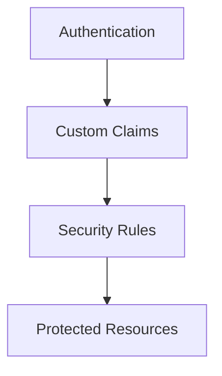

# Role Based Access

> Implementing RBAC systems using Firebase custom claims and Security Rules.

---

# 📚 Table of Contents

- [Role Based Access](#role-based-access)
- [📚 Table of Contents](#-table-of-contents)
- [📌 Overview](#-overview)
- [🏗️ RBAC Architecture](#️-rbac-architecture)
- [🧪 RBAC Rules Example](#-rbac-rules-example)
- [✅ Best Practices](#-best-practices)
- [📖 References](#-references)
- [🧠 Final Notes](#-final-notes)

---

# 📌 Overview

Role-Based Access Control (RBAC) restricts system permissions based on user roles.

---

# 🏗️ RBAC Architecture



---

# 🧪 RBAC Rules Example

```javascript
allow write: if request.auth.token.admin == true;
```

---

# ✅ Best Practices

> [!TIP]
> Always apply least-privilege access principles.

Recommendations:

- Separate admin roles
- Restrict sensitive actions
- Audit permissions regularly
- Validate claims securely

---

# 📖 References

- https://firebase.google.com/docs/auth/admin/custom-claims
- https://firebase.google.com/docs/rules

---

# 🧠 Final Notes

RBAC systems improve operational security and access governance.