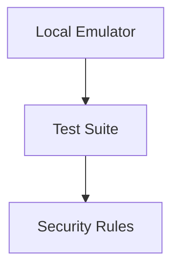

# Rule Testing

> Validating Firebase Security Rules using automated testing workflows.

---

# 📚 Table of Contents

- [Rule Testing](#rule-testing)
- [📚 Table of Contents](#-table-of-contents)
- [📌 Overview](#-overview)
- [⚙️ Testing Architecture](#️-testing-architecture)
- [🧪 Emulator Testing](#-emulator-testing)
- [🚨 Common Issues](#-common-issues)
- [📖 References](#-references)
- [🧠 Final Notes](#-final-notes)

---

# 📌 Overview

Security Rules should always be validated before production deployment.

---

# ⚙️ Testing Architecture



---

# 🧪 Emulator Testing

Start Firebase emulators:

```bash
firebase emulators:start
```

Run test suite:

```bash
npm test
```

---

# 🚨 Common Issues

| Issue | Cause |
|---|---|
| False positive access | Weak rules |
| Emulator mismatch | Incorrect environment |
| Test failures | Invalid assertions |

---

# 📖 References

- https://firebase.google.com/docs/emulator-suite
- https://firebase.google.com/docs/rules/unit-tests

---

# 🧠 Final Notes

Security Rule testing is essential for secure production deployments.