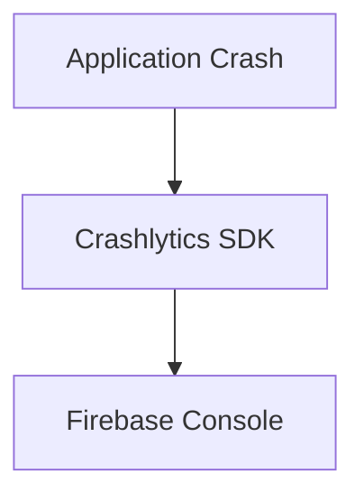

# Crashlytics

> Monitoring application crashes and runtime failures using Firebase Crashlytics.

---

# 📚 Table of Contents

- [Crashlytics](#crashlytics)
- [📚 Table of Contents](#-table-of-contents)
- [📌 Overview](#-overview)
- [🏗️ Crash Reporting Workflow](#️-crash-reporting-workflow)
- [⚙️ Crashlytics Features](#️-crashlytics-features)
- [🚨 Common Issues](#-common-issues)
- [📖 References](#-references)
- [🧠 Final Notes](#-final-notes)

---

# 📌 Overview

Crashlytics provides real-time crash reporting and application stability insights.

---

# 🏗️ Crash Reporting Workflow

---

# ⚙️ Crashlytics Features

| Feature | Description |
|---|---|
| Crash Reports | Runtime error visibility |
| Stack Traces | Debugging support |
| User Impact Metrics | Affected user tracking |
| Real-Time Alerts | Incident notifications |

---

# 🚨 Common Issues

| Issue | Cause |
|---|---|
| Missing crash reports | SDK misconfiguration |
| Delayed reports | Network connectivity |
| Incomplete traces | Minification issues |

---

# 📖 References

- https://firebase.google.com/docs/crashlytics
- https://firebase.google.com/products/crashlytics

---

# 🧠 Final Notes

Crash reporting systems are essential for production application reliability.