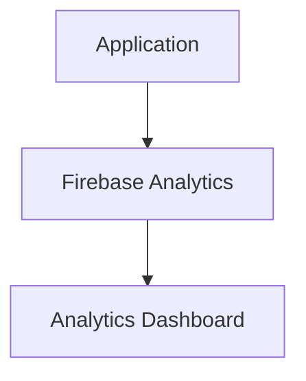

# Firebase Analytics

> Understanding user analytics and event tracking using Firebase Analytics.

---

# 📚 Table of Contents

- [Firebase Analytics](#firebase-analytics)
- [📚 Table of Contents](#-table-of-contents)
- [📌 Overview](#-overview)
- [⚙️ Analytics Architecture](#️-analytics-architecture)
- [🧪 Event Tracking Example](#-event-tracking-example)
- [📊 Common Metrics](#-common-metrics)
- [📖 References](#-references)
- [🧠 Final Notes](#-final-notes)

---

# 📌 Overview

Firebase Analytics provides event-based user analytics for web and mobile applications.

---

# ⚙️ Analytics Architecture



---

# 🧪 Event Tracking Example

```javascript
logEvent(analytics, "login", {
  method: "Google"
});
```

---

# 📊 Common Metrics

| Metric | Description |
|---|---|
| Active Users | User activity |
| Sessions | Session tracking |
| Retention | Returning users |
| Engagement | User interaction |

---

# 📖 References

- https://firebase.google.com/docs/analytics
- https://support.google.com/firebase

---

# 🧠 Final Notes

Analytics systems help improve application decisions and user experience optimization.