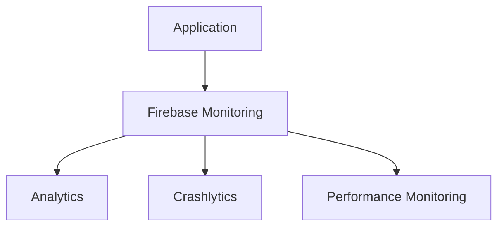

# Firebase Monitoring

> Understanding Firebase monitoring architecture and observability workflows.

---

# 📚 Table of Contents

- [Firebase Monitoring](#firebase-monitoring)
- [📚 Table of Contents](#-table-of-contents)
- [📌 Overview](#-overview)
- [🏗️ Monitoring Architecture](#️-monitoring-architecture)
- [⚙️ Monitoring Components](#️-monitoring-components)
- [✅ Benefits](#-benefits)
- [📖 References](#-references)
- [🧠 Final Notes](#-final-notes)

---

# 📌 Overview

Firebase provides integrated monitoring and observability services for cloud-native applications.

---

# 🏗️ Monitoring Architecture

---

# ⚙️ Monitoring Components

| Component | Purpose |
|---|---|
| Analytics | User behavior |
| Crashlytics | Error reporting |
| Performance Monitoring | Performance metrics |
| Logs | Operational visibility |

---

# ✅ Benefits

> [!TIP]
> Monitoring improves operational visibility and troubleshooting efficiency.

- Real-time observability
- Error tracking
- User insights
- Performance visibility
- Cost awareness

---

# 📖 References

- https://firebase.google.com/docs
- https://cloud.google.com/monitoring

---

# 🧠 Final Notes

Modern cloud systems require comprehensive observability and monitoring strategies.