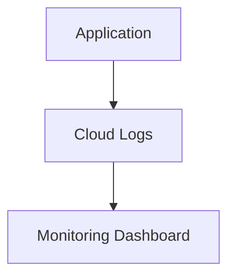

# Logging and Debugging

> Troubleshooting Firebase applications using logs, debugging tools, and observability workflows.

---

# 📚 Table of Contents

- [Logging and Debugging](#logging-and-debugging)
- [📚 Table of Contents](#-table-of-contents)
- [📌 Overview](#-overview)
- [🏗️ Logging Workflow](#️-logging-workflow)
- [⚙️ Debugging Techniques](#️-debugging-techniques)
- [🚨 Common Issues](#-common-issues)
- [📖 References](#-references)
- [🧠 Final Notes](#-final-notes)

---

# 📌 Overview

Logs and debugging tools help engineers diagnose production issues and operational failures.

---

# 🏗️ Logging Workflow

---

# ⚙️ Debugging Techniques

Common debugging strategies:

- Analyze logs
- Monitor traces
- Inspect errors
- Validate configurations
- Review deployments

---

# 🚨 Common Issues

| Issue | Cause |
|---|---|
| Missing logs | Incorrect logging setup |
| Deployment failures | Invalid configuration |
| Silent crashes | Poor exception handling |

---

# 📖 References

- https://firebase.google.com/docs/functions/writing-and-viewing-logs
- https://cloud.google.com/logging

---

# 🧠 Final Notes

Operational visibility is critical for maintaining reliable production environments.