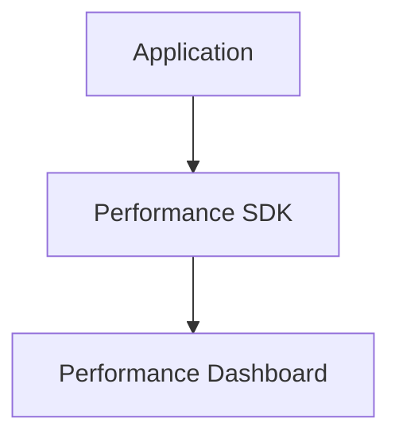

# Performance Monitoring

> Measuring application performance and latency using Firebase Performance Monitoring.

---

# 📚 Table of Contents

- [Performance Monitoring](#performance-monitoring)
- [📚 Table of Contents](#-table-of-contents)
- [📌 Overview](#-overview)
- [⚙️ Monitoring Architecture](#️-monitoring-architecture)
- [📊 Key Metrics](#-key-metrics)
- [✅ Optimization Strategies](#-optimization-strategies)
- [📖 References](#-references)
- [🧠 Final Notes](#-final-notes)

---

# 📌 Overview

Performance Monitoring tracks application speed, latency, and runtime performance.

---

# ⚙️ Monitoring Architecture

---

# 📊 Key Metrics

| Metric | Description |
|---|---|
| App Start Time | Startup latency |
| Network Requests | API performance |
| Screen Rendering | UI responsiveness |
| Trace Duration | Custom performance traces |

---

# ✅ Optimization Strategies

> [!TIP]
> Monitoring bottlenecks helps improve user experience significantly.

Recommendations:

- Optimize API calls
- Reduce bundle size
- Cache assets
- Monitor network latency

---

# 📖 References

- https://firebase.google.com/docs/perf-mon
- https://web.dev/performance-scoring/

---

# 🧠 Final Notes

Performance monitoring improves scalability, responsiveness, and operational efficiency.