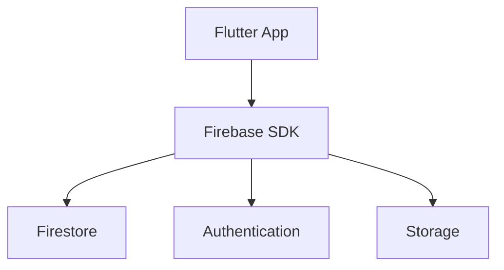

# Firebase with Flutter

> Integrating Firebase backend services into Flutter mobile applications.

---

# 📚 Table of Contents

- [Firebase with Flutter](#firebase-with-flutter)
- [📚 Table of Contents](#-table-of-contents)
- [📌 Overview](#-overview)
- [🏗️ Flutter Architecture](#️-flutter-architecture)
- [🧪 Firebase Initialization](#-firebase-initialization)
- [✅ Best Practices](#-best-practices)
- [📖 References](#-references)
- [🧠 Final Notes](#-final-notes)

---

# 📌 Overview

Flutter integrates closely with Firebase for cross-platform mobile development.

---

# 🏗️ Flutter Architecture



---

# 🧪 Firebase Initialization

```dart
await Firebase.initializeApp();
```

---

# ✅ Best Practices

- Separate services
- Optimize state management
- Use secure authentication
- Monitor app performance

---

# 📖 References

- https://firebase.google.com/docs/flutter/setup
- https://flutter.dev/

---

# 🧠 Final Notes

Flutter and Firebase provide a scalable mobile development ecosystem.