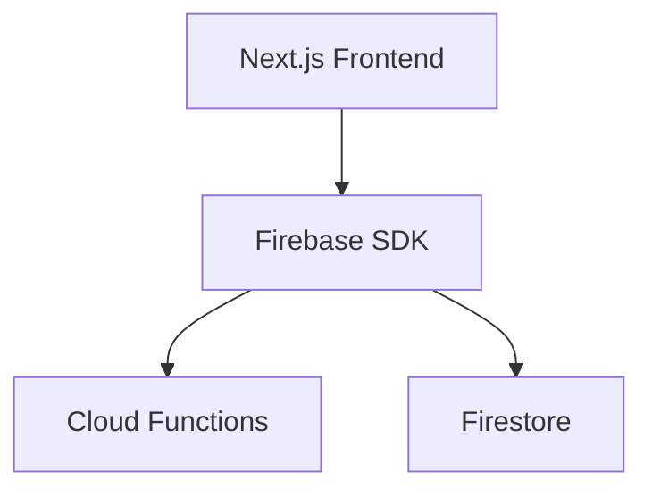

# Firebase with Next.js

> Integrating Firebase into modern Next.js fullstack applications.

---

# 📚 Table of Contents

- [Firebase with Next.js](#firebase-with-nextjs)
- [📚 Table of Contents](#-table-of-contents)
- [📌 Overview](#-overview)
- [🏗️ Next.js Architecture](#️-nextjs-architecture)
- [⚙️ SSR and Firebase](#️-ssr-and-firebase)
- [✅ Best Practices](#-best-practices)
- [📖 References](#-references)
- [🧠 Final Notes](#-final-notes)

---

# 📌 Overview

Next.js applications commonly integrate Firebase for backend and hosting workflows.

---

# 🏗️ Next.js Architecture

---

# ⚙️ SSR and Firebase

Common integration strategies:

- Client-side Firebase SDK
- API routes
- Server-side rendering
- Static site generation

---

# ✅ Best Practices

- Secure environment variables
- Separate server/client logic
- Protect APIs
- Optimize rendering

---

# 📖 References

- https://firebase.google.com/docs/hosting/frameworks/nextjs
- https://nextjs.org/docs

---

# 🧠 Final Notes

Next.js and Firebase create powerful fullstack serverless architectures.