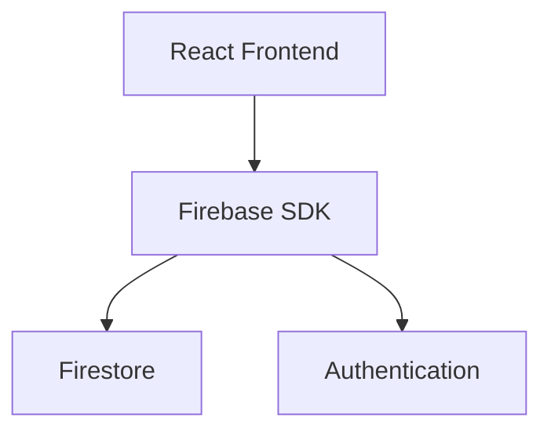

# Firebase with React

> Integrating Firebase services into React applications.

---

# 📚 Table of Contents

- [Firebase with React](#firebase-with-react)
- [📚 Table of Contents](#-table-of-contents)
- [📌 Overview](#-overview)
- [⚙️ React Architecture](#️-react-architecture)
- [🧪 Firebase Initialization](#-firebase-initialization)
- [✅ Best Practices](#-best-practices)
- [📖 References](#-references)
- [🧠 Final Notes](#-final-notes)

---

# 📌 Overview

React applications commonly integrate Firebase for authentication, databases, and hosting.

---

# ⚙️ React Architecture



---

# 🧪 Firebase Initialization

```javascript
import { initializeApp } from "firebase/app";

const app = initializeApp(firebaseConfig);
```

---

# ✅ Best Practices

- Use environment variables
- Modularize Firebase services
- Optimize listeners
- Secure API keys

---

# 📖 References

- https://firebase.google.com/docs/web/setup
- https://react.dev/

---

# 🧠 Final Notes

React and Firebase provide an efficient stack for modern frontend development.