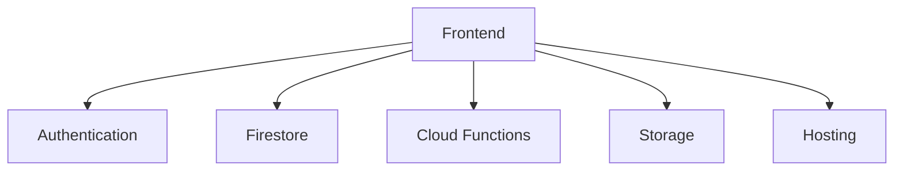

# Fullstack Firebase Architecture

> Designing scalable fullstack applications using Firebase backend services.

---

# 📚 Table of Contents

- [Fullstack Firebase Architecture](#fullstack-firebase-architecture)
- [📚 Table of Contents](#-table-of-contents)
- [📌 Overview](#-overview)
- [🏗️ Architecture Components](#️-architecture-components)
- [⚙️ Fullstack Workflow](#️-fullstack-workflow)
- [✅ Best Practices](#-best-practices)
- [📖 References](#-references)
- [🧠 Final Notes](#-final-notes)

---

# 📌 Overview

Fullstack Firebase architectures integrate frontend applications directly with Firebase backend services.

---

# 🏗️ Architecture Components

---

# ⚙️ Fullstack Workflow

Typical architecture flow:

1. User authentication
2. Firestore data access
3. Cloud Function execution
4. Storage interactions
5. Frontend rendering

---

# ✅ Best Practices

- Separate frontend/backend logic
- Apply Security Rules
- Optimize queries
- Use scalable architecture patterns

---

# 📖 References

- https://firebase.google.com/docs
- https://cloud.google.com/architecture

---

# 🧠 Final Notes

Firebase enables simplified fullstack development using serverless cloud infrastructure.