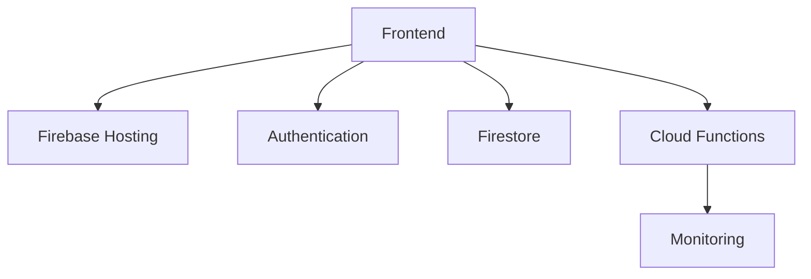

# Production Architecture

> Designing enterprise-grade production architectures using Firebase services.

---

# 📚 Table of Contents

- [Production Architecture](#production-architecture)
- [📚 Table of Contents](#-table-of-contents)
- [📌 Overview](#-overview)
- [🏗️ Production Architecture Model](#️-production-architecture-model)
- [🔐 Security Layers](#-security-layers)
- [⚙️ Operational Best Practices](#️-operational-best-practices)
- [📖 References](#-references)
- [🧠 Final Notes](#-final-notes)

---

# 📌 Overview

Production Firebase systems require scalability, observability, redundancy, and security.

---

# 🏗️ Production Architecture Model

---

# 🔐 Security Layers

Production systems should include:

- Authentication
- Security Rules
- Logging
- Monitoring
- Role-based access control

---

# ⚙️ Operational Best Practices

> [!TIP]
> Production systems should prioritize observability and reliability.

Recommendations:

- Monitor errors
- Configure alerts
- Separate environments
- Implement backups
- Review permissions regularly

---

# 📖 References

- https://cloud.google.com/architecture
- https://firebase.google.com/docs

---

# 🧠 Final Notes

Enterprise cloud systems require secure, observable, and scalable architectures.