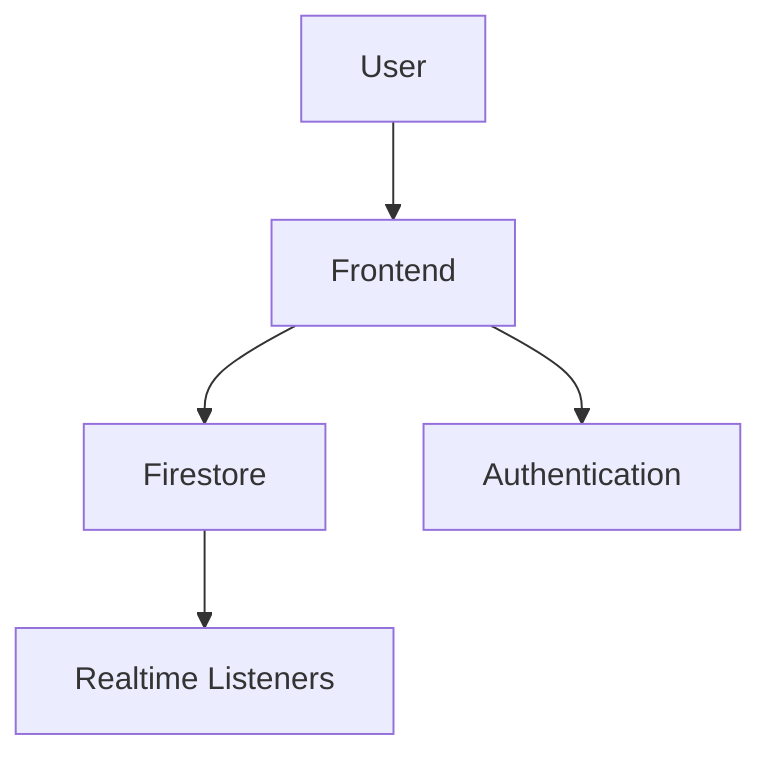

# Realtime Chat Architecture

> Building scalable realtime chat systems using Firebase technologies.

---

# 📚 Table of Contents

- [Realtime Chat Architecture](#realtime-chat-architecture)
- [📚 Table of Contents](#-table-of-contents)
- [📌 Overview](#-overview)
- [🏗️ Chat Architecture](#️-chat-architecture)
- [⚙️ Realtime Workflow](#️-realtime-workflow)
- [🔐 Security Considerations](#-security-considerations)
- [📖 References](#-references)
- [🧠 Final Notes](#-final-notes)

---

# 📌 Overview

Realtime chat systems require low-latency synchronization and scalable messaging infrastructure.

---

# 🏗️ Chat Architecture

---

# ⚙️ Realtime Workflow

Chat workflow:

- User authentication
- Message submission
- Firestore synchronization
- Real-time listener updates

---

# 🔐 Security Considerations

> [!IMPORTANT]
> Chat systems should validate message ownership and authentication.

Recommendations:

- Restrict message access
- Validate users
- Prevent spam
- Monitor abuse

---

# 📖 References

- https://firebase.google.com/docs/firestore
- https://firebase.google.com/docs/auth

---

# 🧠 Final Notes

Realtime systems require efficient synchronization and scalable event-driven architectures.