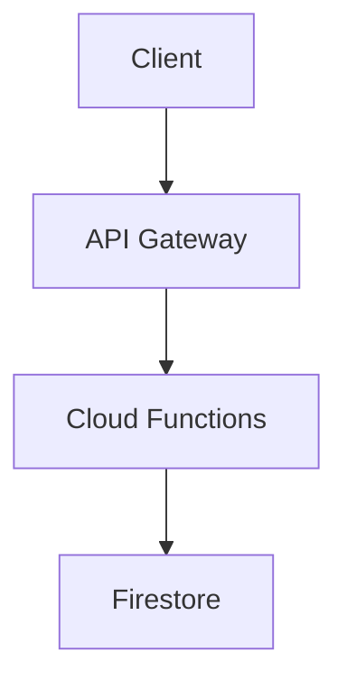

# Serverless API Architecture

> Designing scalable serverless APIs using Firebase Cloud Functions.

---

# 📚 Table of Contents

- [Serverless API Architecture](#serverless-api-architecture)
- [📚 Table of Contents](#-table-of-contents)
- [📌 Overview](#-overview)
- [🏗️ API Architecture](#️-api-architecture)
- [⚙️ Request Workflow](#️-request-workflow)
- [✅ Best Practices](#-best-practices)
- [📖 References](#-references)
- [🧠 Final Notes](#-final-notes)

---

# 📌 Overview

Serverless APIs simplify backend management by using managed cloud execution environments.

---

# 🏗️ API Architecture

---

# ⚙️ Request Workflow

API flow:

1. Client request
2. Authentication validation
3. Cloud Function execution
4. Firestore interaction
5. Response generation

---

# ✅ Best Practices

- Validate input
- Protect endpoints
- Use modular APIs
- Monitor execution metrics

---

# 📖 References

- https://firebase.google.com/docs/functions
- https://cloud.google.com/functions/docs

---

# 🧠 Final Notes

Serverless APIs improve scalability and operational simplicity for cloud-native applications.